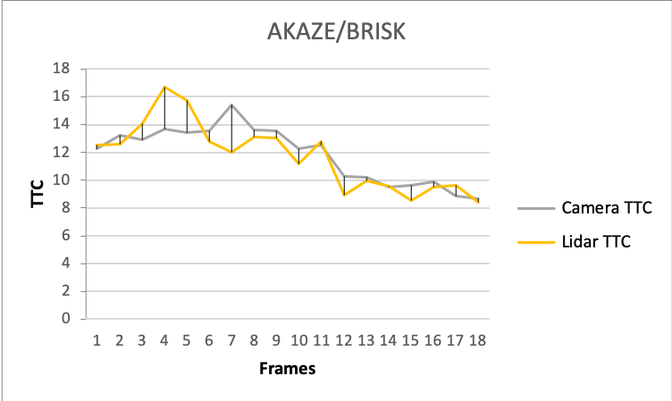

## 3D Object Tracking report
>FP.0 Final Report
>
>_Provide a Writeup / README that includes all the rubric points and how you addressed each one. You can submit your writeup as markdown or pdf._

This is the project report to cover all points of the  3D Object Tracking project rubic of the Sensor Fusion Nano Degree program. The goal of the project is to build a collision avoidance system, based on camera and LIDAR sensor inputs. The system calculates the TTC - **T**ime **T**o **C**ollision based on the individual LIDAR and camera inputs.

## FP.1 Match 3D Objects

>FP.1 Match 3D Objects
>
>_Implement the method "matchBoundingBoxes", which takes as input both the previous and the current data frames and provides as output the ids of the matched regions of interest (i.e. the boxID property). Matches must be the ones with the highest number of keypoint correspondences._

The function "matchBoundingBoxes" basically builds up a matrix of bounding boxes of the previous data frame versus the bounding boxes of the current data frame. The value for each combination gets initialized with zero.

```c++
    //Matrix of bBoxes prev x bBoxes curr and number of matched key points between as value
    int interBBmatchingCounts[bbCount_prev][bbCount_curr];`
```
| vs          | CurrBB_ID_0 | CurrBB_ID_1 | CurrBB_ID_2 | CurrBB_ID_3 | CurrBB_ID_4 | CurrBB_ID_5 | CurrBB_ID_6 | CurrBB_ID_7 | CurrBB_ID_8 | CurrBB_ID_9 | CurrBB_ID_10 |
|-------------|-------------|-------------|-------------|-------------|-------------|-------------|-------------|-------------|-------------|-------------|--------------|
| PrevBB_ID_0 | 0           | 0           | 0           | 0           | 0           | 0           | 0           | 0           | 0           | 0           | 0            |
| PrevBB_ID_1 | 0           | 0           | 0           | 0           | 0           | 0           | 0           | 0           | 0           | 0           | 0            |
| PrevBB_ID_2 | 0           | 0           | 0           | 0           | 0           | 0           | 0           | 0           | 0           | 0           | 0            |
| PrevBB_ID_3 | 0           | 0           | 0           | 0           | 0           | 0           | 0           | 0           | 0           | 0           | 0            |
| PrevBB_ID_4 | 0           | 0           | 0           | 0           | 0           | 0           | 0           | 0           | 0           | 0           | 0            |
| PrevBB_ID_5 | 0           | 0           | 0           | 0           | 0           | 0           | 0           | 0           | 0           | 0           | 0            |

Now the function iterates through all key point matches and checks within which bounding boxes the corresponding key point (in previous frame as well as current frame) residing in and increases the matrix for each combination by one.

```c++
    //increasing match counter between id_prev and id_curr
    interBBmatchingCounts[bbID_prev][bbID_curr] += 1;
```

| vs          | CurrBB_ID_0 | CurrBB_ID_1 | CurrBB_ID_2 | CurrBB_ID_3 | CurrBB_ID_4 | CurrBB_ID_5 | CurrBB_ID_6 | CurrBB_ID_7 | CurrBB_ID_8 | CurrBB_ID_9 | CurrBB_ID_10 |
|-------------|-------------|-------------|-------------|-------------|-------------|-------------|-------------|-------------|-------------|-------------|--------------|
| PrevBB_ID_0 | 0           | 0           | 0           | 0           | 0           | 0           | 0           | 0           | 0           | 0           | 0            |
| PrevBB_ID_1 | 0           | 0           | 0           | 0           | 0           | 0           | 0           | 0           | 0           | 0           | 0            |
| PrevBB_ID_2 | 0           | 0           | 0           | 0           | 0           | 0           | 0           | 0           | 0           | 0           | 0            |
| PrevBB_ID_3 | 0           | 0           | 0           | **1**           | 0           | 0           | 0           | 0           | **1**           | 0           | **1**            |
| PrevBB_ID_4 | 0           | 0           | 0           | 0           | 0           | 0           | 0           | 0           | 0           | 0           | 0            |
| PrevBB_ID_5 | 0           | 0           | 0           | 0           | 0           | 0           | 0           | 0           | 0           | 0           | 0            |

Over all key point matches, this sums up to a matrix, showing kind of the bounding box connectivity based on key point matches between the two frames.

| vs          | CurrBB_ID_0 | CurrBB_ID_1 | CurrBB_ID_2 | CurrBB_ID_3 | CurrBB_ID_4 | CurrBB_ID_5 | CurrBB_ID_6 | CurrBB_ID_7 | CurrBB_ID_8 | CurrBB_ID_9 | CurrBB_ID_10 |
|-------------|-------------|-------------|-------------|-------------|-------------|-------------|-------------|-------------|-------------|-------------|--------------|
| PrevBB_ID_0 | **199**         | 23          | 2           | 62          | 6           | 12          | 2           | 6           | 0           | 5           | 2            |
| PrevBB_ID_1 | 29          | **148**         | 0           | 14          | 63          | 5           | 1           | 0           | 2           | 1           | 5            |
| PrevBB_ID_2 | 1           | 3           | **16**          | 1           | 2           | 4           | 4           | 0           | 0           | 0           | 1            |
| PrevBB_ID_3 | 71          | 6           | 1           | **119**         | 4           | 1           | 0           | 0           | 8           | 3           | 24           |
| PrevBB_ID_4 | 1           | 0           | 0           | 0           | 0           | 0           | 0           | 0           | 0           | **2**           | 0            |
| PrevBB_ID_5 | 2           | 4           | 4           | 1           | 0           | **71**          | 0           | 0           | 0           | 1           | 1            |

The combinations with the highest connections is provided as result.

## FP.2 Compute Lidar-based TTC

>_Compute the time-to-collision in second for all matched 3D objects using only Lidar measurements from the matched bounding boxes between current and previous frame._

The function computeTTCLidar calculates the TTC for objects within the Ego Lane (median) according to the following formula, where $$d_0$$ and $$d_1$$ are the distances, measured from two sequently data frames frames, and $$\Delta t$$ is the difference in time between those data frames.

$$TTC = \frac{d_1\Delta t}{d_0-d_1}$$

The lidar points get limited to the ego lane via the following code snippets.

```c++
vector<double> prevDataVector;
    for (auto &it : lidarPointsPrev) {
        if (abs(it.y) <= laneWidth / 2.0) {
            prevDataVector.push_back(it.x);
        }
    }
```

```c++
    vector<double> currDataVector;
    for (auto &it : lidarPointsCurr) {
        if (abs(it.y) <= laneWidth / 2.0) {
            currDataVector.push_back(it.x);
        }
    }
```

To minimize the impact of outliers, the TTC gets calculated based on the median instead of the average of all remaining data points. Therefore the data gets sorted and the median selected for both, previous and current data frame. In case there are no remaining data points left, the TTC is been set to NAN.
Another solution of dealing with outliers can be found [here](https://github.com/yosoufe/SFND_3D_Object_Tracking/blob/master/report.md#FP2), which will be taken into consideration for future improvements.


## FP.3 Associate Keypoint Correspondences with Bounding Boxes

>_Prepare the TTC computation based on camera measurements by associating keypoint correspondences to the bounding boxes which enclose them. All matches which satisfy this condition must be added to a vector in the respective bounding box._

The function clusterKptMatchesWithROI associates all key points out of the current date frame with a given bounding box, if they reside within that area.

```c++
for(auto match : kptMatches)
    {
        auto kpt = kptsCurr.at(match.trainIdx);
        if(boundingBox.roi.contains(kpt.pt))
        {
            kptMatchesInROI.push_back(match);
            avDistOfkptMachtesInROI += match.distance;
        }
    }
```
 
Furthermore it will ignore key points, which reside in that area, but exceed a given threshold, to filter out erroneous matches.

```c++
for(auto match : kptMatchesInROI)
    {
        if(match.distance < threshould)
        {
            boundingBox.kptMatches.push_back(match);
        }
    }
```

## FP.4 Compute Camera-based TTC

>_Compute the time-to-collision in second for all matched 3D objects using only keypoint correspondences from the matched bounding boxes between current and previous frame._

The function computeTTCCamera calculates the TTC based on provided key point matches according to the following formula, where $$h_0$$ is the distance of two key points within the previous frame, and $$h_1$$ the distance of the matched key points within the current frame. The time between the two measurements $$\Delta t$$ is given by the frame rate.


The euclidean distance is been calculated via the cv::norm function in the code. Side note on this can be found [here](https://stackoverflow.com/a/55111972).

```c++
    // compute distances and distance ratios
    double distCurr = cv::norm(kpOuterCurr.pt - kpInnerCurr.pt);
    double distPrev = cv::norm(kpOuterPrev.pt - kpInnerPrev.pt);
```
The distance ratio $$\frac{h_1}{h_0}$$ gets been calculated for all combinations where the distance is above a certain threshold. The distance ratio provides information about the relative movement of the key points in sequently frames, in this example the distance increases when the proceeding vehicle gets closer to the camera and therefore gets bigger in the image. This been set into relation with the time between those two measurements is leading to the TTC information we are looking for.
In comparison to the lidar calculation, where an decreased distance (proceeding vehicle vs. ego car) is leading to an lower TTC, here an increased distance (two key points on the proceesing car) is leading to an lower TTC.

Again the median instead of average is been used to lower the impact of outliers.

## FP.5 Performance Evaluation 1

_Find examples where the TTC estimate of the Lidar sensor does not seem plausible. Describe your observations and provide a sound argumentation why you think this happened._

Initial assumption is that the ego vehicle is continuously getting closer to the vehicle in front (resulting in monotonously decreasing TTC). Within the results it can be observed, that e.g. between frames 2/3 and 3/4, the Lidar based TTC is increasing instead of decreasing.
Since the calculation is working fine, the reason must be within the data e.g. lidar points associated with the bounding box / ROI but not been part of the proceeding vehicle (outliers) or a noisy measurement.

If we compare the visualization of frame one and frame six, it can be observed that frame one contains nice and dense measurements of the cars back with only a bit spreading on the outsides.

Frame six in comparison contains much more scattered measurements including some which can be considered as outliers.  

 
For lowering the impact of such outliers, the average filter got replaced by an median filter. In the following graphic, the TTC got calculated for the first seven frames, based on the minimum value and the median value for each frame.
One can see that the median filter is already improving the robustness a lot, though, the results still show an impact by such outliers and noise.


As a next step the filtering could be improved by removing a certain percentage from the upper and lower end before calculating the median to even more reduce the impact of unsharp measurements.


## FP.6 Performance Evaluation 2

_Run several detector / descriptor combinations and look at the differences in TTC estimation. Find out which methods perform best and also include several examples where camera-based TTC estimation is way off. As with Lidar, describe your observations again and also look into potential reasons._

The camera based TTC calculation is directly depending on the performance of the detector/descriptor and matcher combination. For a reliable TTC calculation a sufficient amount of key points and correct matches is essential.
In the following good and bad examples are shown. 

### Good examples
Detector Type | Descriptor Type | Matcher Type | Selector Type |
--|--|--|--|
SHITOMASI | BRISK | MAT_BF | SEL_NN |


Detector Type | Descriptor Type | Matcher Type | Selector Type |
--|--|--|--|
AKAZE | BRISK | MAT_BF | SEL_NN |



Detector Type | Descriptor Type | Matcher Type | Selector Type |
--|--|--|--|
SIFT | FREAK | MAT_BF | SEL_NN |


### Bad example

Within the results it can be observed, that due to few key points provided by the HARRIS detector, the TTC calculation is unreliable and misleading. An example is given below.

Detector Type | Descriptor Type | Matcher Type | Selector Type |
--|--|--|--|
HARRIS | SIFT | MAT_BF | SEL_NN |


